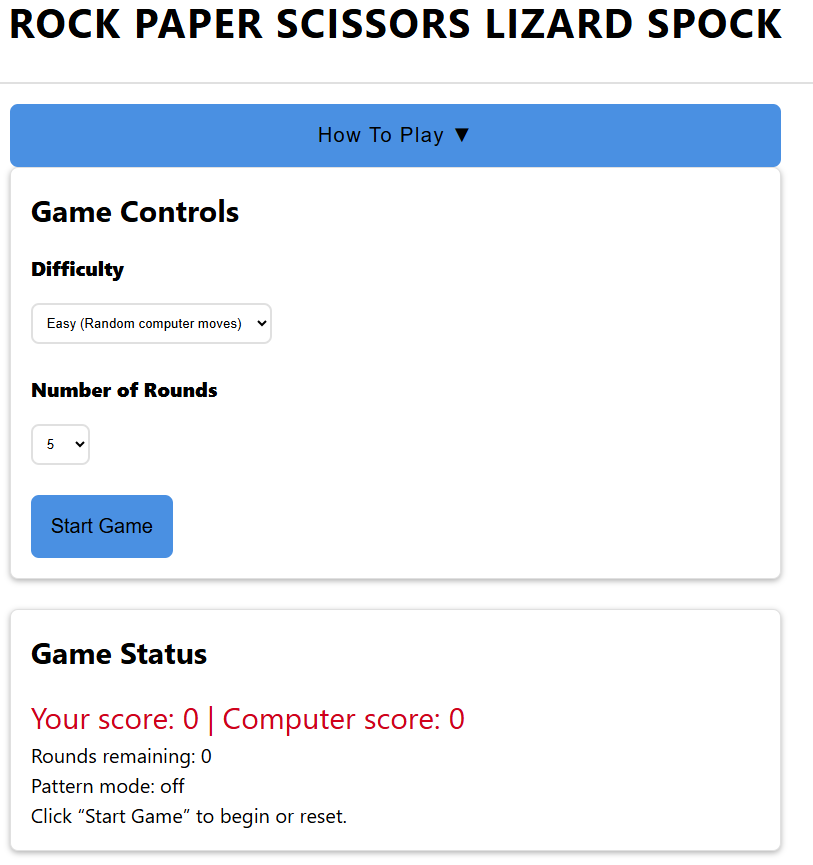
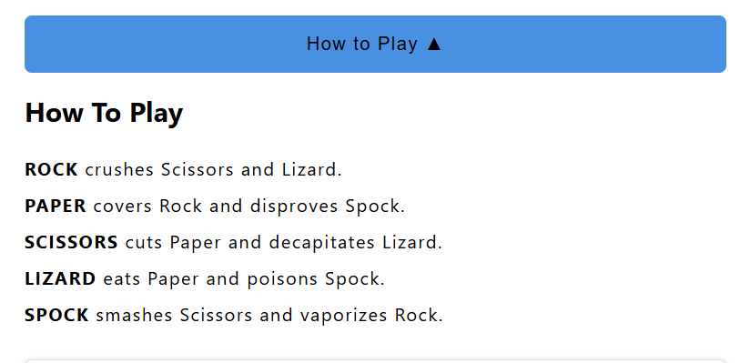
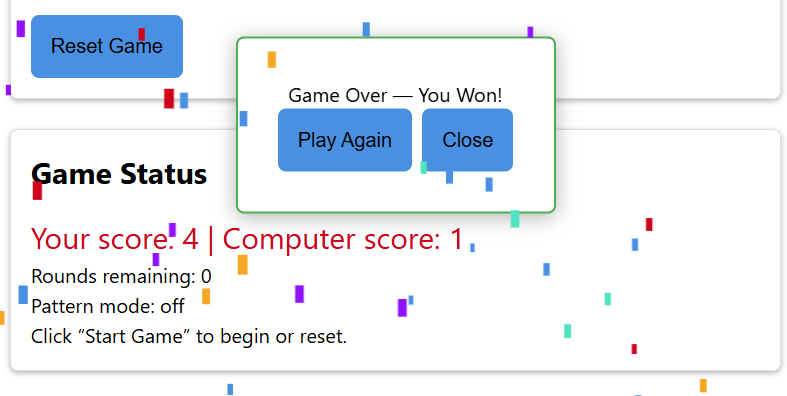
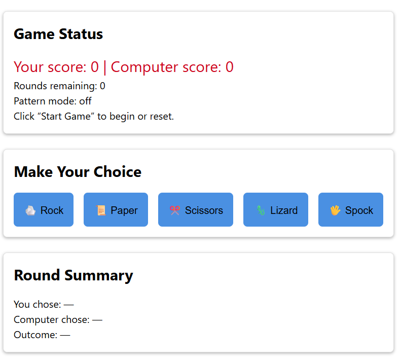
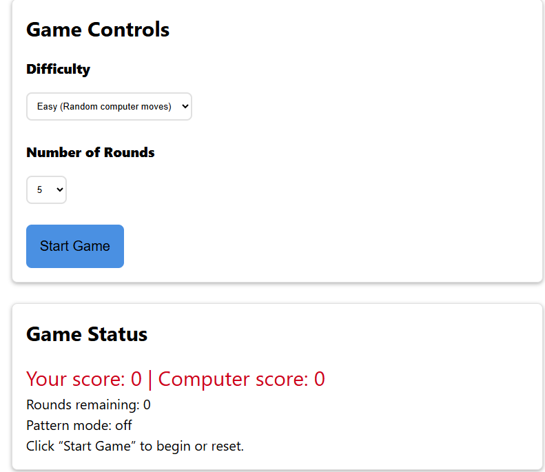
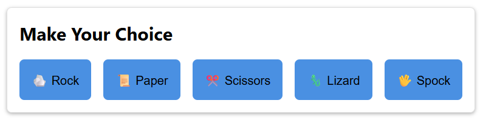
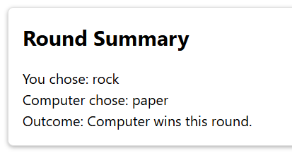

# Rock Paper Scissors Lizard Spock (The Game)

## Description
A browser‑based implementation of the expanded version of the classic ROCK PAPER SCISSORS. This version adds two extra gestures — LIZARD and SPOCK, creating a more strategic and entertaining experience.

## Features
- Five‑gesture gameplay: Rock, Paper, Scissors, Lizard, Spock.
- Clean, responsive UI.
- Clear WIN, LOSE or DRAW logic with all gesture interactions.
- Score tracking.
- Accessible, semantic HTML structure.
- Modular CSS and JavaScript for maintainability.
- Smooth animations and visual feedback.
- A YouTube link in the footer. This link opens YouTube a new tab, showing how to play "ROCK PAPER SCISSORS LIZARD SPOCK" tutorial videos.  

## Rules of the game
Each gesture defeats two others and is defeated by two.
Here’s the full interaction table:
| Gesture  | Defeats   | Loses to  |
|----------|-----------|-----------|
| Rock  | Scissors, Lizard   | Paper, Spock   |
| Paper  | Rock, Spock   | Scissors, Lizard   |
| Scissors  | Paper, Lizard   | Rock, Spock   |
| Lizard  | Spock, Paper   | Rock, Scissors   |
| Spock  | Scissors, Rock   | Paper, Scissors |

## Game Logic
The game randomly selects a gesture for the computer.
Your choice and the computer’s choice are compared using a predefined ruleset mapping each gesture to the two it defeats.

## How to play the game
From the "Game Controls" panel:
- Choose difficulty level (Easy, Medium or Hard).
- Choose number of rounds (5, 10 or 15).
- Click "Start Game".

Go to the "Make Your Choice" panel.
- Choose either Rock, Paper, Scissors, Lizard or Spock. (The game starts right away).

The "Round Summary" panel displays the results for each round.

## Future improvements
- Add sound effects
- Add a match history panel
- Add multiplayer mode
- Add more animations

## Testing
Extensive testing has been conducted to ensure that the site works reliably and provides users with a straightforward way to achieve their goals. Each feature was checked for functionality, usability, and accessibility. The webpage has been tested on multiple screen sizes (mobile, tablet, desktop and larger). Layout adapts responsively. Text remains legible and buttons are easy to interact with on all screen sizes.

### Browser Compatibility
- All major browsers render the site consistently.
- CSS styles, hover effects, and layout behave as intended across platforms.

### Accessibility
- Semantic HTML structure supports screen readers.
- Color contrast between text and background meets accessibility standards.

### Bugs and Issues Discovered
No bugs have been discovered yet.

### Code validation
#### HTML
No errors were returned when passing through the official W3C validator.

#### CSS
No errors were found when passing through the official (Jigsaw) validator.

#### JavaScript
No significant issues found when passed through a linter.

## Deployment

The site is deployed to GitHub pages. The live link can be found here - https://danielvivor.github.io/rock-paper-scissors-lizard-spock/

## Credits

